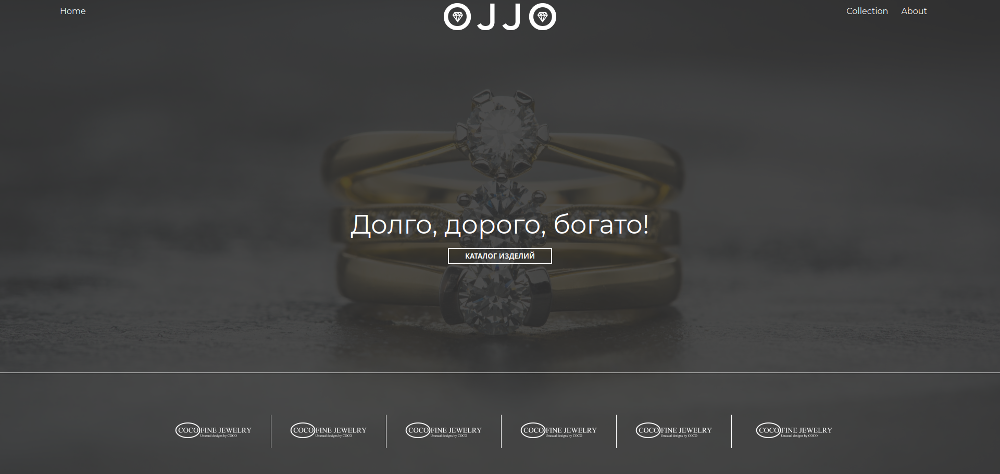

# OJJO - Макет сайта на Vite



Этот проект представляет собой макет веб-сайта OJJO, созданный с использованием инструмента Vite. 


## Описание

Этот макет сайта создан с целью визуальной демонстрации дизайна и макета будущего проекта OJJO. Он включает в себя несколько страниц, таких как "About", "Collection", и "Home", с различными компонентами и стилями.

## Технологии

- **Vite**: Инструмент для быстрой разработки веб-приложений.

## Запуск проекта

Для просмотра этого макета сайта выполните следующие шаги:

1. Склонируйте репозиторий на свой локальный компьютер:

   ```bash
   git clone https://github.com/your-username/ojjo-mockup.git

2. Перейдите в директорию проекта:

   ````bash 
   cd OJJO.app

3. Установите зависимости:

   ```````bash
   npm install

4. Запустите проект:
   
   ``````bash 
   npm run dev

5.  Откройте веб-браузер и перейдите по адресу http://localhost:3000, чтобы увидеть макет сайта OJJO в действии.


## Структура проекта

    /src - Исходный код проекта.
    /public - Статические файлы, такие как изображения и шрифты.


## Использование

Проект предоставляет несколько страниц для демонстрации различных элементов дизайна и компонентов. Перейдите на страницы "About", "Collection", и "Home", чтобы оценить дизайн и структуру проекта.

